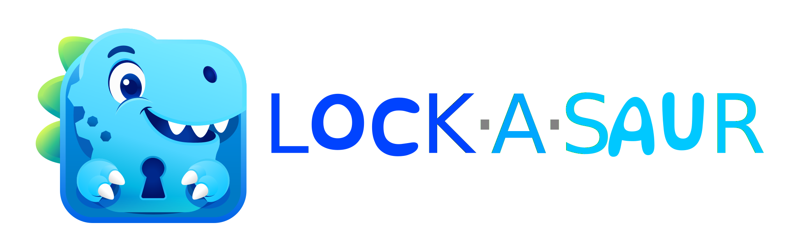

<br>
<div align="center">

<p><> with ❤️ by Sam</p>
</div>
<hr>

## Description
* Lockasaur: simple app to encrypt files and folders with a password (encryption with bite)
* Encrypted files use the `.dino` extension; files from older releases (`.ctx`) still decrypt
* Runs on macOS, Windows, and Linux (one universal macOS app; x64 and arm64 packages on Windows and Linux)

## Install
- Download the latest release from https://github.com/sampalest/cryptox/releases

Beta builds are not code signed:

- **Windows**: SmartScreen shows "Windows protected your PC" on first launch. Click "More info", then "Run anyway". This is the expected prompt for unsigned apps, not a malware detection.
- **macOS**: the app is not notarized; if Gatekeeper blocks it, right click the app and choose Open.
- **Linux (Ubuntu)**: install the `.deb` package (`sudo apt install ./Lockasaur-<arch>.deb`); it installs the AppArmor profile Ubuntu 24.04 needs and a working Chromium sandbox. Make sure the downloaded file's arch matches your machine (`x64` vs `arm64`, check with `uname -m`: `x86_64` vs `aarch64`).

## Development

Lockasaur uses npm with a committed `package-lock.json`. Use Node.js 24 LTS for local development:

```bash
nvm use
npm install
```

Run the app in development mode:

```bash
npm run electron:serve
```

### Tests and linting

```bash
npm run lint
npm run test:unit
npm run test:e2e
npm run test:large
```

`test:unit` includes the security regression suite for the crypto format and file handling invariants (tamper rejection, no-overwrite output, tar extraction hardening, cancellation cleanup, legacy format compatibility).

`test:e2e` runs a real Electron smoke test for startup, renderer load, and preload bridge availability.

`test:large` generates a 1 GB file and a 1 GB folder and verifies the UI progress/status contract against real output visibility, printing timing metrics. Override the payload size with `LOCKASAUR_LARGE_SIZE_MB` (e.g. `LOCKASAUR_LARGE_SIZE_MB=128 npm run test:large`). The "Large payload tests" GitHub Actions workflow runs this suite on Linux, macOS and Windows via manual dispatch.

### Build and packaging

```bash
npm run build
npm run build:electron
npm run electron:build
```

The renderer is built with Vite into `dist/`. Electron main and preload bundles are built into `dist-electron/` before local app startup or packaging. `npm run electron:build` packages the host operating system into `dist_electron/`: macOS produces one `Lockasaur.dmg` containing native x64 and arm64 binaries, while Windows and Linux produce `Lockasaur-<arch>.exe` and `Lockasaur-<arch>.deb`. Release builds produce the universal macOS DMG on an arm64 runner and separate x64 and arm64 packages for Windows and Linux on native-architecture runners. Artifacts ship unsigned for the beta (see the Install section for the resulting OS prompts); macOS notarization is skipped unless the required environment is configured.

See [CHANGELOG.md](CHANGELOG.md) for release history and upgrade notes.

## Contributing

Before opening an issue or pull request, read the [contribution guide](docs/CONTRIBUTING.md). It explains the development workflow, review requirements, and maintainer decision policy.

## Use this app
Just drag the file or folder you want to encrypt, set a password and that's it. Easy!
All file types are supported.

<div align="center">

</div>

## Special thanks and credits
### Libs
- Electron
- Vue.js (Pinia, Vue Router)
- libsodium (Argon2id, AES-256-GCM)
- tar-fs
- Node libs

## Author
Sampalest

## License
**Lockasaur** is licensed under the [PolyForm Noncommercial License 1.0.0](LICENSE).

It is free for personal and noncommercial use: you can use it, modify it, share it, and contribute. Commercial use by companies is not permitted. See the full terms in the [LICENSE](LICENSE) file or at [polyformproject.org](https://polyformproject.org/licenses/noncommercial/1.0.0/).
