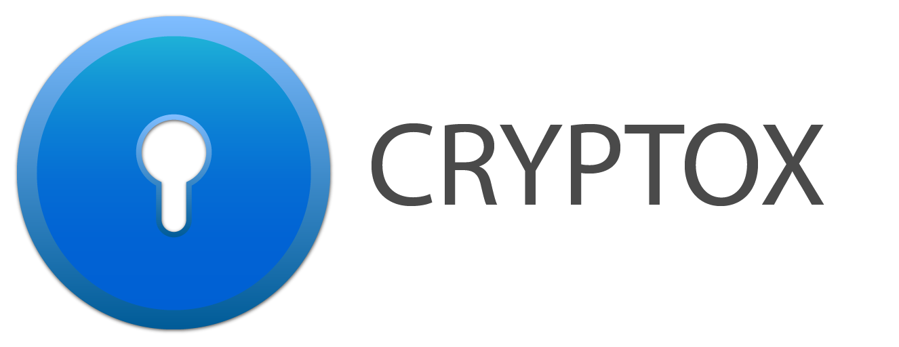

<br>
<div align="center">

<p><> with ❤️ by Sam</p>
</div>
<hr>

## Version 0.3.4-alpha

## Description
* Simple app for encrypt files
* Support macOS
* Windows and Linux coming soon...

## Install
- Download latest release from https://github.com/sampalest/cryptox/releases

## Development

Cryptox uses npm with a committed `package-lock.json`. Use Node.js 24 LTS for local development:

```bash
nvm use
npm install
```

Run the app in development mode:

```bash
npm run electron:serve
```

### Tests and linting

```bash
npm run lint
npm run test:unit
npm run test:e2e
```

`test:e2e` runs a real Electron smoke test for startup, renderer load, and preload bridge availability.

### Build and packaging

```bash
npm run build
npm run build:electron
npm run electron:build
```

The renderer is built with Vite into `dist/`. Electron main and preload bundles are built into `dist-electron/` before local app startup or packaging. `npm run electron:build` produces macOS `dmg` and `zip` artifacts in `dist_electron/`. Local notarization is skipped unless the required notarization environment is configured.

See [CHANGELOG.md](CHANGELOG.md) for release history and upgrade notes.

## Use this app
Just drag file or folder you want to encrypt, set a password and that's it. Easy!
Support all files.

<div align="center">

</div>

## Special thanks and credits
### Libs
- Vue.js
- Materialize
- Electron
- Node libs
- Archiver
- Animate.css
- ...

## Author
Samuel Palomo Esteban

## License
**Cryptox** is licensed under the [PolyForm Noncommercial License 1.0.0](LICENSE).

It is free for personal and noncommercial use: you can use it, modify it, share it, and contribute. Commercial use by companies is not permitted. See the full terms in the [LICENSE](LICENSE) file or at [polyformproject.org](https://polyformproject.org/licenses/noncommercial/1.0.0/).
